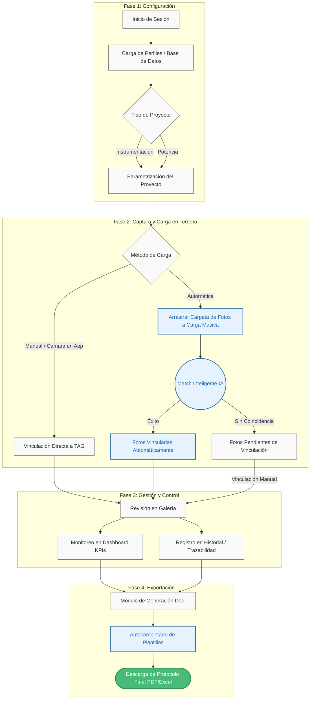

# Diagrama del Flujo de Trabajo

A continuación se presenta el diagrama del flujo de trabajo de la aplicación. (Generado utilizando Mermaid, el cual puedes visualizar en visores de Markdown compatibles).

